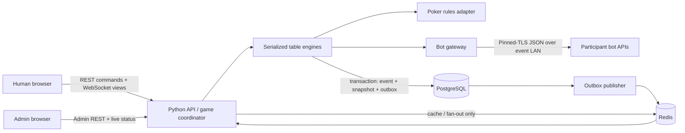

# Human vs. Poker Bot Tournament: Initial Scope and Architecture

Status: rough proposal for discussion  
Last reviewed: 2026-10-01

## Executive recommendation

Build a deliberately small, server-authoritative tournament platform:

- No-limit Texas Hold'em only for the first event.
- One deployable backend application, one web application, PostgreSQL, and Redis.
- A serialized game loop per table; every human or bot decision enters that same loop.
- PostgreSQL is the durable system of record. Redis is a cache and live-update transport, not the owner of game state.
- Participant browsers communicate only with the backend through HTTPS/REST and WebSockets. They never connect to Redis or directly to bots.
- The backend calls each registered bot at a verified LAN IP and port through a narrow, versioned JSON protocol.
- Use an existing poker rules engine behind an adapter, but own tournament orchestration, bot isolation, persistence, authorization, and recovery ourselves.

The goal of the first release is a boring, observable, recoverable tournament. A 3D table should be a later renderer over the same player-safe view model.

## Proposed MVP boundary

### In scope

- Local email/password accounts with user and admin roles.
- A user can register a human entrant or a bot entrant. Keep login identity separate from entrant type so a person can own and test a bot without needing an awkward second authentication model.
- Bot endpoint registration with an IPv4/IPv6 address and port, ownership challenge, health check, and conformance test.
- An admin can create, configure, open registration for, seat, start, pause/resume, and complete a tournament.
- Configurable starting stack, seats per table, blind/ante schedule, action clock, optional time bank, break schedule, and registration cutoff.
- A functional 2D human table: hole cards, community cards, stacks, pot/side pots, action history, legal action controls, turn timer, reconnect, and clear error states.
- Mixed human/bot tables using the same authoritative game engine.
- Elimination, table balancing/breaking, heads-up transition, and final winner.
- Bot documentation, versioned schemas, starter bots, a conformance runner, and deterministic practice games.
- Durable hand histories, admin audit history, metrics, and an event-day operator runbook.

### Explicitly defer

- 3D presentation, avatars, animation polish, chat, social features, mobile polish, and public profiles.
- Multiple poker variants, cash games, real-money flows, payments, prizes, bounties, rebuys, add-ons, satellites, and exotic tournament formats.
- Internet-hosted bot endpoints. The first version is restricted to the controlled event LAN.
- Horizontal backend scaling unless the expected table count proves one process insufficient. Reliability is easier with one writer than with premature distributed coordination.

## Architecture



### Suggested stack

- **Backend:** Python 3.12+, FastAPI, Pydantic, SQLAlchemy, and Alembic. Python gives the cleanest path to PokerKit; FastAPI handles WebSockets and strict typed API boundaries well.
- **Poker engine candidate:** [PokerKit](https://github.com/uoftcprg/pokerkit), isolated behind our own `PokerEngine` interface. It is MIT-licensed, supports no-limit Texas Hold'em, exposes operation history/hand histories, and reports extensive type checking and test coverage. Its [simulation documentation](https://pokerkit.readthedocs.io/en/stable/simulation.html) shows a fine-grained state machine rather than only a hand evaluator.
- **Web:** React + TypeScript. Next.js or Vite are both reasonable; choose after deciding whether server-rendered pages matter. They probably do not for a LAN event.
- **Durable data:** PostgreSQL.
- **Ephemeral/live data:** Redis.
- **Local deployment:** Docker Compose on a dedicated event machine, with pinned image and dependency versions.

PokerKit is a candidate, not yet a commitment. Before building around it, run a short adapter spike covering heads-up blinds, multi-way all-ins, side pots, odd chips, minimum raises, incomplete all-in raises and action reopening, showdown ties, and reconstruction after process restart. Do not expose PokerKit types outside the adapter. If the spike fails, the rest of the architecture remains usable with another engine.

### Component responsibilities

1. **Auth and registration**
   - Store passwords with Argon2id, following [OWASP password-storage guidance](https://cheatsheetseries.owasp.org/cheatsheets/Password_Storage_Cheat_Sheet.html), and use secure, HTTP-only session cookies.
   - Model `users.role` separately from `entrants.kind` (`human` or `bot`).
   - Bootstrap the first admin with a one-time deployment command; do not grant admin rights merely because an account uses a hard-coded "magic" email address.

2. **Tournament service**
   - Own the tournament lifecycle, blind clock, breaks, seating, table balancing, eliminations, and completion.
   - Treat house rules as explicit configuration, not scattered conditionals.
   - Audit every admin command with actor, timestamp, reason, and before/after state.

3. **Table coordinator**
   - Run one serialized command queue per table. Only that coordinator may mutate its table.
   - Validate `table_version`, turn ownership, action legality, and idempotency key before applying a command.
   - Persist an append-only event, a private recovery snapshot, and an outbox row in one PostgreSQL transaction.
   - Never hold a database transaction open while waiting for a human or remote bot.

4. **Poker engine adapter**
   - Translate application commands into engine operations and engine state into application-owned snapshots.
   - Supply legal actions and amounts; never trust a client to calculate legality.
   - Keep chip amounts as integers. Define a raise as `amount_to`, meaning total chips committed on the current betting street, to avoid "raise by" versus "raise to" ambiguity.

5. **Bot gateway**
   - Own registration challenges, request signing, deadlines, response-size limits, strict parsing, schema validation, and conversion of all failures into a normal game outcome.
   - Make a pending decision durable before performing the network call. A restart can then resume or expire it safely.
   - Accept only the first valid response for a `decision_id`; duplicates and late responses are logged and ignored.

6. **Player view/WebSocket gateway**
   - Build an allowlisted view for each recipient. A player sees only their own hole cards; spectators see none; completed-hand visibility follows the house rules.
   - Publish monotonically versioned notifications. On a gap or reconnect, the browser fetches a fresh authorized snapshot.
   - Do not serialize the internal engine object or private table snapshot to a client.

### Why PostgreSQL plus Redis

Redis is useful for current-view caching, presence, and fast WebSocket fan-out, but it should not be the only game record. Redis Pub/Sub is explicitly at-most-once: disconnected subscribers miss messages. The [Redis documentation](https://redis.io/docs/latest/develop/use-cases/pub-sub/) recommends keeping durable state in keys or another system and using Pub/Sub as transport; its [persistence documentation](https://redis.io/docs/latest/management/persistence/) also describes the loss tradeoffs of snapshots and AOF.

PostgreSQL should own accounts, tournament configuration, seats, actions, hand results, private recovery state, and audit events. Redis can disappear temporarily without corrupting a tournament: connected clients may stop receiving pushes, then recover from PostgreSQL-backed snapshots. If durable asynchronous worker delivery becomes necessary, Redis Streams are available, but they add delivery/deduplication concerns and are not required for the first single-process deployment.

Suggested durable tables:

- `users`, `sessions`, `entrants`, `bot_endpoints`
- `tournaments`, `blind_levels`, `tournament_entries`
- `tables`, `seats`, `hands`
- `game_events`, `table_snapshots`, `pending_decisions`
- `admin_audit_events`, `outbox_events`

## One action from end to end

1. The table coordinator persists an `awaiting_action` event containing a unique `decision_id`, the acting seat, the authoritative UTC deadline, and table version. In-process waits use a monotonic clock so wall-clock adjustments cannot extend a turn.
2. A human receives an authorized WebSocket view, or the bot gateway builds an authorized bot observation.
3. The human submits an idempotent command, or the bot returns a signed response.
4. The coordinator rejects stale, duplicate, wrong-seat, malformed, or illegal commands without changing state.
5. The poker adapter applies one legal action.
6. In one transaction, the backend appends the action/result events, stores the recovery snapshot, advances the table version, and writes outbox notifications.
7. The publisher updates Redis and notifies WebSocket sessions. Clients that miss the notification resync by version.
8. If no valid decision arrives by the authoritative deadline, the coordinator records the configured fallback as an ordinary event: check when legal, otherwise fold.

This flow is the same for people and bots. That prevents bot-specific game logic from drifting away from the human game.

## Bot protocol, version 1 sketch

The server constructs the URL from the verified address and port; registrants do not supply an arbitrary URL. Suggested fixed endpoints are:

- `GET /v1/health`
- `POST /v1/verify`
- `POST /v1/action`

Example action request (illustrative, not the final schema):

```json
{
  "protocol_version": "1.0",
  "decision_id": "01J...",
  "tournament_id": "t_123",
  "table_id": "table_2",
  "hand_id": "hand_91",
  "table_version": 481,
  "deadline_at": "2026-10-02T03:15:01.250Z",
  "you": {
    "seat": 4,
    "stack": 7600,
    "committed_this_street": 200,
    "hole_cards": ["As", "Td"]
  },
  "game": {
    "variant": "no_limit_texas_holdem",
    "street": "flop",
    "button_seat": 1,
    "small_blind": 100,
    "big_blind": 200,
    "community_cards": ["7h", "Tc", "2s"],
    "pot": 1500,
    "side_pots": [],
    "seats": [],
    "action_history": []
  },
  "legal_actions": [
    {"action": "fold"},
    {"action": "call", "amount": 400},
    {"action": "raise", "min_amount_to": 800, "max_amount_to": 7800}
  ]
}
```

Example response:

```json
{
  "protocol_version": "1.0",
  "decision_id": "01J...",
  "action": "raise",
  "amount_to": 1200
}
```

Protocol requirements:

- Publish machine-readable JSON Schema and generated examples. Every object sets `additionalProperties: false`, as supported by the [JSON Schema specification](https://json-schema.org/understanding-json-schema/reference/object).
- Require `Content-Type: application/json`, exactly one JSON object, bounded body size, UTF-8, integer chip values, and finite bounded collection/string lengths. Reject duplicate keys and non-standard numbers such as `NaN` and infinity.
- Include a protocol version and reject unsupported major versions.
- Protect bot traffic with TLS because it contains private hole cards. For IP-address endpoints, have the starter kit generate a bot certificate and register its certificate/fingerprint through the authenticated web session; the gateway trusts only that pinned certificate. HMAC-sign request bytes with the entrant's secret using timestamp and `decision_id`, and sign responses similarly. Never put another player's private cards or the undealt deck in a request.
- Use separate connect and total deadlines, no redirects, no proxy environment variables, and no automatic live-decision retry. If a restart causes a repeated request, the same `decision_id` makes it idempotent.
- Convert connection errors, non-200 responses, oversized bodies, malformed JSON, schema failures, invalid signatures, illegal actions, and late responses into the same deterministic fallback policy. The gateway must never throw through the game loop.
- Record reason and latency for every failure, but avoid storing secrets in logs.

The older [ACPC protocol](https://pokerkit.readthedocs.io/en/stable/_static/protocol.pdf) is useful prior art for identifiers and poker observations, but a versioned JSON contract is more approachable for this event and supports multi-player state more naturally.

## Shared Wi-Fi and bot safety

"Everyone is on the same Wi-Fi" helps only if the network permits device-to-device traffic. Before event day, verify all of the following on the actual access point:

- Client/AP isolation is disabled for the participant network.
- The tournament server has a stable address, preferably wired to the router.
- Human/admin traffic uses HTTPS with a trusted, pre-provisioned event hostname/certificate; do not discover certificate problems on event day.
- Bot machines receive DHCP reservations or re-register when their address changes.
- Host firewalls allow the selected bot port on the event network.
- IPv4/IPv6 behavior is known, and the server can reach every bot from the exact deployment container/network namespace.
- Capacity and latency remain acceptable with the expected number of participants.

User-supplied bot destinations are also an SSRF surface. The [OWASP SSRF guidance](https://cheatsheetseries.owasp.org/cheatsheets/Server_Side_Request_Forgery_Prevention_Cheat_Sheet.html) recommends allowlisting known targets, accepting host data rather than arbitrary URLs, constructing the URL server-side, and disabling redirects. For this deployment:

- Accept a normalized IP address plus integer port, not scheme/path/query/userinfo.
- Fix the `https` scheme and paths server-side; disable redirects and DNS names in v1.
- Permit only the dedicated participant address range and approved port range. Explicitly block the tournament host, router/admin addresses, loopback, link-local addresses, cloud metadata addresses, and infrastructure subnets.
- Verify endpoint ownership with a short-lived challenge tied to the logged-in entrant before saving or seating it.
- Run bot egress from a low-privilege process/container with no database credentials and firewall rules that can reach only the participant network.
- Apply per-endpoint connection limits, byte limits, and deadlines.

If direct inbound bot hosting or participant certificate setup proves unreliable during the network spike, the best contingency is an outbound persistent TLS bot connection to the tournament server. That avoids participant firewall, certificate-serving, and address-change problems while preserving the same application-level observation/response schema.

## Failure behavior to decide and test

| Failure | Safe behavior |
| --- | --- |
| Human WebSocket disconnect | Clock continues; reconnect fetches the latest authorized snapshot. |
| Bot timeout, malformed response, or illegal action | Record the reason; check if legal, otherwise fold. Never stop the table. |
| Duplicate/late human or bot response | Ignore by `decision_id`/idempotency key and table version. |
| Backend restarts while awaiting action | Reconstruct from PostgreSQL; honor the stored deadline or apply the recorded fallback once. |
| Redis unavailable | Continue authoritative writes; temporarily use direct/local notification or polling; resync clients later. |
| PostgreSQL unavailable | Pause affected tables safely. Do not accept actions that cannot be committed durably. |
| Unexpected engine invariant failure | Quarantine/pause that table and alert the admin. Do not guess a result. Other tables continue. |
| Admin/browser refresh | Restore from server state; admin commands are idempotent and audited. |

## Testing strategy

### Engine and invariant tests

- Golden test hands for blinds/antes, heads-up order, folds, checks, calls, minimum raises, under-raises, all-ins, side pots, ties, odd chips, show/muck behavior, button movement, eliminations, and table balancing.
- Property-based tests: total chips are conserved; a card appears in at most one place; only the acting seat can act; stacks and pots never go negative; table versions increase; a completed hand has one deterministic result.
- Differential tests for the adapter against published examples and selected PokerKit tests.

### Bot contract tests

- Publish a conformance runner that sends representative observations and grades schema, signature, legality, and timing.
- Provide minimal Python and JavaScript starter bots plus a deterministic reference bot.
- Provide practice tables that use production protocol code but never affect the tournament.
- Inject refusal, reset, slow response, slow body, invalid UTF-8, duplicate JSON keys, oversized JSON, wrong IDs, unsupported versions, and illegal amounts.

### Recovery and system tests

- Kill the backend before a bot call, during a bot call, and after the DB commit but before publication; verify exactly one game action results.
- Disconnect Redis, restart PostgreSQL, reconnect browsers, and expire a pending action.
- Run mixed human/bot end-to-end games with seeded decks and assert final hand histories.
- Soak at the expected peak table/bot count for longer than the planned event duration.
- Conduct a full dress rehearsal on the actual server, router/AP, Docker images, browser devices, and participant bot machines. Preserve an offline copy of all images, docs, and starter kits.

## Delivery sequence

### Phase 0: rules and risk spike

- Freeze the v1 house rules and tournament parameters.
- Prove PokerKit behind the adapter acceptance cases.
- Prove server-to-bot connectivity on the real Wi-Fi and decide whether direct HTTP is viable.
- Write the bot v1 JSON Schemas and failure policy before UI work.

Exit criterion: a command-line program can run and replay a complete mixed-player hand, including a failing bot, without corrupting state.

### Phase 1: one-table vertical slice

- Accounts/roles, human and bot registration, endpoint verification.
- Admin creates and starts one tournament/table.
- Functional human UI, WebSocket projection, bot gateway, hand history.
- PostgreSQL event/snapshot recovery and basic metrics.

Exit criterion: a full table of humans and reference bots plays repeatedly through browser refreshes and injected bot failures.

### Phase 2: tournament orchestration

- Blind clock/breaks, seating, multiple tables, rebalancing, eliminations, heads-up final, and result export.
- Practice/conformance portal and starter SDKs.
- Restricted, audited operator controls.

Exit criterion: a seeded multi-table tournament finishes deterministically in automated end-to-end tests.

### Phase 3: hardening and rehearsal

- Property/fault/recovery/soak testing, security review, dashboards/alerts, backup/restore, and runbook.
- Freeze dependencies and deployment artifacts; rehearse on event hardware and network.

Exit criterion: the team completes a full mock event and the documented recovery drills without manual database edits.

### Phase 4: presentation

- Add the 3D table as a client-side renderer of the stable player view. Game logic and protocol remain unchanged.

## Decisions needed before implementation

1. Confirm that v1 is play-money, no-limit Texas Hold'em and define maximum entrants/tables.
2. Choose table size, starting stack, blind/ante schedule, breaks, late registration, and whether re-entry/rebuy is excluded.
3. Choose the normal action clock, time-bank behavior, and exact timeout/invalid-action fallback.
4. Define tournament house rules for incomplete all-in raises, odd chips, table balancing, sit-outs/disconnects, showing/mucking, and blind-level changes mid-hand. Use the current [Poker Tournament Directors Association rules](https://www.pokertda.com/poker-tda-rules/) as a baseline, then document deliberate deviations.
5. Confirm control of the event router/AP and whether direct server-to-participant connections can be enabled.
6. Decide spectator access and when hand histories/private cards become visible.
7. Decide whether one user may register multiple entrants and whether a human may also own a bot.

The first three technical artifacts should be the house-rules document, bot protocol schema, and PokerKit/network spike. They remove the highest-risk ambiguity before significant UI work begins.
